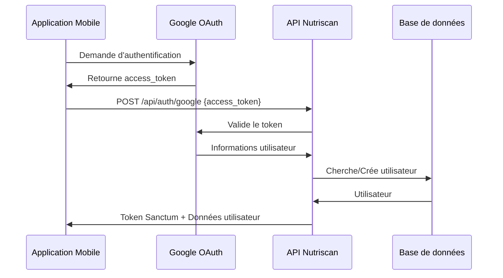
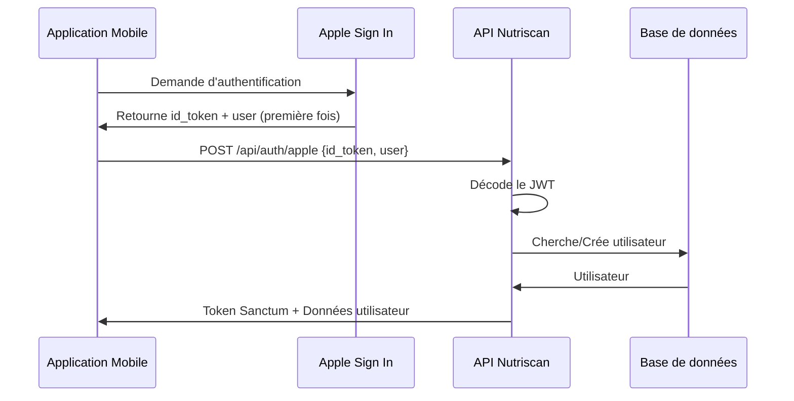

# Documentation API - Authentification Sociale Nutriscan

## 🔐 Authentification avec Google et Apple

L'API Nutriscan supporte l'authentification via **Google** et **Apple** en utilisant Laravel Socialite.

---

## 📋 Configuration

### Variables d'environnement

Ajoutez ces variables dans votre fichier `.env` :

```env
# Google OAuth
GOOGLE_CLIENT_ID=your-google-client-id
GOOGLE_CLIENT_SECRET=your-google-client-secret
GOOGLE_REDIRECT_URI=http://localhost:8000/api/auth/google/callback

# Apple Sign In
APPLE_CLIENT_ID=your-apple-client-id
APPLE_CLIENT_SECRET=your-apple-client-secret
APPLE_REDIRECT_URI=http://localhost:8000/api/auth/apple/callback
```

### Configuration Google OAuth

1. Aller sur [Google Cloud Console](https://console.cloud.google.com/)
2. Créer un nouveau projet ou sélectionner un existant
3. Activer l'API Google+ 
4. Créer des identifiants OAuth 2.0
5. Ajouter les URI de redirection autorisées

### Configuration Apple Sign In

1. Aller sur [Apple Developer](https://developer.apple.com/)
2. Créer un Service ID
3. Configurer Sign in with Apple
4. Générer une clé privée
5. Configurer les domaines et URL de retour

---

## 🚀 Endpoints

### 1. Connexion avec Google

Authentifier un utilisateur avec son compte Google.

**Endpoint:** `POST /api/auth/google`

**Headers:**
```http
Content-Type: application/json
Accept: application/json
```

**Body:**
```json
{
  "access_token": "ya29.a0AfH6SMBx..."
}
```

**Réponse (200):**
```json
{
  "success": true,
  "message": "Connexion avec Google réussie",
  "data": {
    "user": {
      "id": 1,
      "name": "John Doe",
      "email": "john@gmail.com",
      "role": "user",
      "profile_photo_url": "http://localhost:8000/storage/profile-photos/abc123.jpg",
      "provider": "google"
    },
    "token": "3|abcdefghijklmnopqrstuvwxyz..."
  }
}
```

**Erreur (400):**
```json
{
  "success": false,
  "message": "Erreur lors de la connexion avec Google",
  "error": "Invalid credentials"
}
```

---

### 2. Connexion avec Apple

Authentifier un utilisateur avec son compte Apple.

**Endpoint:** `POST /api/auth/apple`

**Headers:**
```http
Content-Type: application/json
Accept: application/json
```

**Body (première connexion):**
```json
{
  "id_token": "eyJraWQiOiJlWGF1bm1...",
  "user": {
    "name": {
      "firstName": "John",
      "lastName": "Doe"
    },
    "email": "john@privaterelay.appleid.com"
  }
}
```

**Body (connexions suivantes):**
```json
{
  "id_token": "eyJraWQiOiJlWGF1bm1..."
}
```

> ⚠️ **Note**: Apple n'envoie les informations utilisateur (nom, email) que lors de la première connexion. Ensuite, seul l'`id_token` est fourni.

**Réponse (200):**
```json
{
  "success": true,
  "message": "Connexion avec Apple réussie",
  "data": {
    "user": {
      "id": 2,
      "name": "John Doe",
      "email": "john@privaterelay.appleid.com",
      "role": "user",
      "profile_photo_url": "https://ui-avatars.com/api/?name=John+Doe&color=ED1C24&background=F7941D",
      "provider": "apple"
    },
    "token": "4|abcdefghijklmnopqrstuvwxyz..."
  }
}
```

---

### 3. Lier un compte social

Lier un compte Google ou Apple à un compte existant.

**Endpoint:** `POST /api/auth/link-provider`

**Headers:**
```http
Authorization: Bearer {token}
Content-Type: application/json
Accept: application/json
```

**Body (Google):**
```json
{
  "provider": "google",
  "access_token": "ya29.a0AfH6SMBx..."
}
```

**Body (Apple):**
```json
{
  "provider": "apple",
  "id_token": "eyJraWQiOiJlWGF1bm1..."
}
```

**Réponse (200):**
```json
{
  "success": true,
  "message": "Compte Google lié avec succès",
  "data": {
    "user": {
      "id": 1,
      "name": "John Doe",
      "email": "john@example.com",
      "role": "user",
      "profile_photo_url": "...",
      "provider": "google"
    }
  }
}
```

**Erreur (400):**
```json
{
  "success": false,
  "message": "Ce compte Google est déjà lié à un autre utilisateur"
}
```

---

### 4. Délier un compte social

Supprimer la liaison avec un compte Google ou Apple.

**Endpoint:** `POST /api/auth/unlink-provider`

**Headers:**
```http
Authorization: Bearer {token}
Accept: application/json
```

**Réponse (200):**
```json
{
  "success": true,
  "message": "Compte social délié avec succès"
}
```

**Erreur (400):**
```json
{
  "success": false,
  "message": "Vous devez définir un mot de passe avant de délier votre compte social"
}
```

> ⚠️ **Sécurité**: Un utilisateur ne peut délier son compte social que s'il a défini un mot de passe, pour éviter de se retrouver sans moyen de connexion.

---

## 🔄 Flux d'authentification

### Flux Google



### Flux Apple



---

## 💡 Logique de gestion des comptes

### Création de compte

1. **Nouveau utilisateur**: Un nouveau compte est créé avec les informations du provider
2. **Email existant**: Le compte existant est lié au provider
3. **Provider déjà lié**: L'utilisateur est connecté avec son compte existant

### Données stockées

```sql
users:
  - provider: 'google' | 'apple' | null
  - provider_id: ID unique du provider
  - provider_token: Token d'accès (Google)
  - provider_refresh_token: Token de rafraîchissement (si disponible)
  - password: null pour les comptes sociaux uniquement
```

---

## 📱 Intégration mobile

### Flutter - Google Sign In

```dart
import 'package:google_sign_in/google_sign_in.dart';
import 'package:http/http.dart' as http;
import 'dart:convert';

class GoogleAuthService {
  final GoogleSignIn _googleSignIn = GoogleSignIn(
    scopes: ['email', 'profile'],
  );

  Future<Map<String, dynamic>> signInWithGoogle() async {
    try {
      // Connexion Google
      final GoogleSignInAccount? account = await _googleSignIn.signIn();
      if (account == null) return {};

      // Récupérer le token
      final GoogleSignInAuthentication auth = await account.authentication;
      
      // Envoyer à l'API
      final response = await http.post(
        Uri.parse('http://localhost:8000/api/auth/google'),
        headers: {'Content-Type': 'application/json'},
        body: jsonEncode({
          'access_token': auth.accessToken,
        }),
      );

      if (response.statusCode == 200) {
        return jsonDecode(response.body);
      } else {
        throw Exception('Login failed');
      }
    } catch (e) {
      print('Error: $e');
      return {};
    }
  }
}
```

### Flutter - Apple Sign In

```dart
import 'package:sign_in_with_apple/sign_in_with_apple.dart';
import 'package:http/http.dart' as http;
import 'dart:convert';

class AppleAuthService {
  Future<Map<String, dynamic>> signInWithApple() async {
    try {
      // Connexion Apple
      final credential = await SignInWithApple.getAppleIDCredential(
        scopes: [
          AppleIDAuthorizationScopes.email,
          AppleIDAuthorizationScopes.fullName,
        ],
      );

      // Préparer les données
      Map<String, dynamic> body = {
        'id_token': credential.identityToken,
      };

      // Ajouter les infos utilisateur si disponibles (première connexion)
      if (credential.givenName != null || credential.familyName != null) {
        body['user'] = {
          'name': {
            'firstName': credential.givenName ?? '',
            'lastName': credential.familyName ?? '',
          },
          'email': credential.email ?? '',
        };
      }

      // Envoyer à l'API
      final response = await http.post(
        Uri.parse('http://localhost:8000/api/auth/apple'),
        headers: {'Content-Type': 'application/json'},
        body: jsonEncode(body),
      );

      if (response.statusCode == 200) {
        return jsonDecode(response.body);
      } else {
        throw Exception('Login failed');
      }
    } catch (e) {
      print('Error: $e');
      return {};
    }
  }
}
```

### React Native - Google Sign In

```javascript
import { GoogleSignin } from '@react-native-google-signin/google-signin';
import axios from 'axios';

// Configuration
GoogleSignin.configure({
  webClientId: 'YOUR_GOOGLE_CLIENT_ID',
  offlineAccess: true,
});

const signInWithGoogle = async () => {
  try {
    await GoogleSignin.hasPlayServices();
    const userInfo = await GoogleSignin.signIn();
    const tokens = await GoogleSignin.getTokens();

    // Envoyer à l'API
    const response = await axios.post('http://localhost:8000/api/auth/google', {
      access_token: tokens.accessToken,
    });

    return response.data;
  } catch (error) {
    console.error(error);
  }
};
```

### React Native - Apple Sign In

```javascript
import appleAuth from '@invertase/react-native-apple-authentication';
import axios from 'axios';

const signInWithApple = async () => {
  try {
    const appleAuthRequestResponse = await appleAuth.performRequest({
      requestedOperation: appleAuth.Operation.LOGIN,
      requestedScopes: [appleAuth.Scope.EMAIL, appleAuth.Scope.FULL_NAME],
    });

    const { identityToken, fullName, email } = appleAuthRequestResponse;

    // Préparer les données
    const data = {
      id_token: identityToken,
    };

    // Ajouter les infos utilisateur si disponibles
    if (fullName || email) {
      data.user = {
        name: {
          firstName: fullName?.givenName || '',
          lastName: fullName?.familyName || '',
        },
        email: email || '',
      };
    }

    // Envoyer à l'API
    const response = await axios.post('http://localhost:8000/api/auth/apple', data);

    return response.data;
  } catch (error) {
    console.error(error);
  }
};
```

---

## 🔒 Sécurité

### Bonnes pratiques

1. **Validation des tokens**
   - Les tokens sont validés côté serveur
   - Utilisation de HTTPS obligatoire en production

2. **Gestion des emails**
   - Les emails des providers sont considérés comme vérifiés
   - `email_verified_at` est automatiquement défini

3. **Liaison de comptes**
   - Un compte provider ne peut être lié qu'à un seul utilisateur
   - Vérification avant la liaison

4. **Déliaison sécurisée**
   - Impossible de délier sans mot de passe défini
   - Évite de bloquer l'accès au compte

---

## ⚠️ Limitations et notes

### Apple Sign In

- **Première connexion uniquement**: Apple n'envoie les informations utilisateur (nom, email) que lors de la première authentification
- **Email privé**: Apple peut fournir un email de relais privé
- **Stockage requis**: Sauvegardez les informations lors de la première connexion

### Google Sign In

- **Token expiration**: Les tokens Google expirent après 1 heure
- **Refresh token**: Utilisez le refresh token pour obtenir un nouveau token d'accès

---

## 🧪 Tests

### Test avec cURL (Google)

```bash
curl -X POST http://localhost:8000/api/auth/google \
  -H "Content-Type: application/json" \
  -H "Accept: application/json" \
  -d '{
    "access_token": "YOUR_GOOGLE_ACCESS_TOKEN"
  }'
```

### Test avec cURL (Apple)

```bash
curl -X POST http://localhost:8000/api/auth/apple \
  -H "Content-Type: application/json" \
  -H "Accept: application/json" \
  -d '{
    "id_token": "YOUR_APPLE_ID_TOKEN",
    "user": {
      "name": {
        "firstName": "John",
        "lastName": "Doe"
      },
      "email": "john@example.com"
    }
  }'
```

---

## 📊 Structure de la base de données

```sql
ALTER TABLE users ADD COLUMN provider VARCHAR(255) NULL;
ALTER TABLE users ADD COLUMN provider_id VARCHAR(255) NULL;
ALTER TABLE users ADD COLUMN provider_token VARCHAR(500) NULL;
ALTER TABLE users ADD COLUMN provider_refresh_token VARCHAR(500) NULL;
ALTER TABLE users MODIFY password VARCHAR(255) NULL;
CREATE INDEX idx_provider ON users(provider, provider_id);
```

---

## 🐛 Dépannage

### Erreur: "Invalid credentials"
- Vérifiez que le token n'est pas expiré
- Vérifiez les credentials OAuth dans `.env`

### Erreur: "Ce compte est déjà lié"
- L'utilisateur doit d'abord délier le compte existant
- Ou se connecter avec le compte déjà lié

### Apple: Pas de nom/email
- Normal après la première connexion
- Les données sont déjà en base de données

---

## 📚 Ressources

- [Laravel Socialite Documentation](https://laravel.com/docs/11.x/socialite)
- [Google Sign-In Documentation](https://developers.google.com/identity/sign-in/web/sign-in)
- [Apple Sign In Documentation](https://developer.apple.com/sign-in-with-apple/)
- [Flutter Google Sign In](https://pub.dev/packages/google_sign_in)
- [Flutter Apple Sign In](https://pub.dev/packages/sign_in_with_apple)
